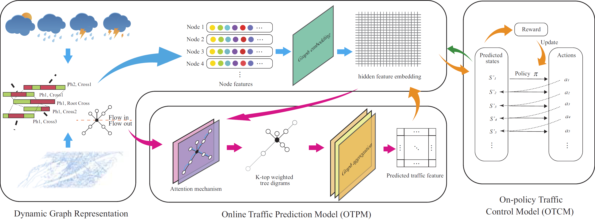

TPSCF: Mitigating Action Hysteresis in Traffic Signal Control with Traffic Predictive Reinforcement Learning
==================================================

## 1. Overview

## 2. Experimental Results

Using the same simulation environment to test different methods, we successively intercepted the traffic flow visualization diagram of the same local road network at t=6000, 7000, 8000, 9000, 10000, 11000 and 12000.
The experimental results are show in these two gifs:

### TPSCF:

### MDQN:

